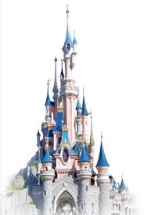

# Disney-Text-Mining
This text Minig project is in collaboration with Disneyland Paris.

The objectives of this project will be to scrape data from
Booking, an online booking site, and integrate this data into a database, then analyse the information from this database.
from this database. To do this, an interactive application
application will be used to guide this study, particularly through the comments of Internet users.

## Links for the use of the app

https://youtu.be/mW7N6dF6qvk

https://youtu.be/K_f6g6LyURw
